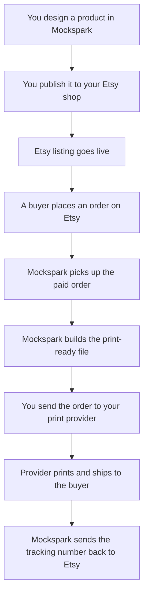

This page explains what happens behind the scenes. Read it if you want to know where your data goes before you connect your shop, or if you are reviewing this app on behalf of Etsy.

## The Full Path

A few notes on the steps that surprise people.

**Mockspark checks Etsy for new orders every 15 minutes.** Etsy does not push order notifications to apps the way some platforms do, so Mockspark asks Etsy for recent paid orders on a schedule. A new order usually shows up in Mockspark within 15 minutes of being paid, sometimes sooner.

**Print files are built for you, not by you.** Once an order arrives, Mockspark renders each print area at full resolution and stores the file. You do not need to export anything.

**Sending to the print provider is a decision you make.** Mockspark prepares the order and waits. Nothing goes to Printful or Printify until you send it.

## What Mockspark Reads from Your Etsy Shop

When you connect your shop, Etsy shows you a permission screen. The table below lists every line on that screen, in Etsy's own wording and in the order Etsy shows it, so you can read the two side by side. Mockspark asks for nothing beyond these.

| What Etsy asks for | What Mockspark does with it |
| --- | --- |
| Connect to your account | Identifies which Etsy account approved the connection, so the shop can be linked to your Mockspark account |
| see billing and shipping addresses | Passes the buyer's delivery address to your print provider so the parcel can be addressed |
| Read your user profile | Etsy shows this line for the email permission. Any contact details that come with an order are displayed on the order page, so you can reach the buyer yourself if something needs sorting out. Mockspark never emails your buyers and never uses these details for marketing |
| delete listings | Removes a draft listing that Mockspark itself created if publishing fails partway through. Listings you created yourself are never deleted |
| see all listings (including expired etc) | Checks whether a listing Mockspark published still exists before updating it |
| create/edit listings | Publishes your products, and updates prices, photos, and variants when you republish |
| see private shop info | Reads your shipping profiles, return policies, production partners, processing times, currency, and the country you ship from, so the publish form can offer you real choices instead of blank fields |
| update shop | Creates one shipping profile, and only if you ask for it while publishing. Mockspark never edits shipping profiles you made yourself |
| see all checkout/payment data | Brings paid orders into Mockspark so they can be produced. Mockspark reads what was ordered and what the buyer paid. Card and bank details are not part of what Etsy's API returns, so Mockspark never receives them |
| update receipts | Marks an order as shipped and sends the tracking number back to Etsy after your print provider ships it |

## What Mockspark Does Not Do

- It does not read or reply to your Etsy messages.
- It does not touch listings you created outside Mockspark.
- It does not change your prices, policies, or shop settings on its own.
- It does not issue refunds or cancel orders on Etsy. If you need to refund a buyer, you do that in Etsy.
- It does not scrape Etsy. Everything it does goes through the official Etsy API.

## Where Your Designs Live

Your artwork, mockups, and finished print files are stored by Mockspark. Etsy only ever receives the finished listing photos you publish. Print providers only receive the print file for orders you choose to send them.

## Disconnecting

You can disconnect a shop from Mockspark at any time, which stops order syncing right away. To cut off access completely, also revoke the app in Etsy Shop Manager under **Apps** then **Connected apps**. [Connect Your Etsy Shop](/docs/connections/etsy/connect) covers both steps.

## Next

<Card title="Connect Your Etsy Shop" icon="link" href="/docs/connections/etsy/connect">
  Authorize Mockspark and get your shop linked.
</Card>

---

The term 'Etsy' is a trademark of Etsy, Inc. This application uses the Etsy API but is not endorsed or certified by Etsy, Inc.
